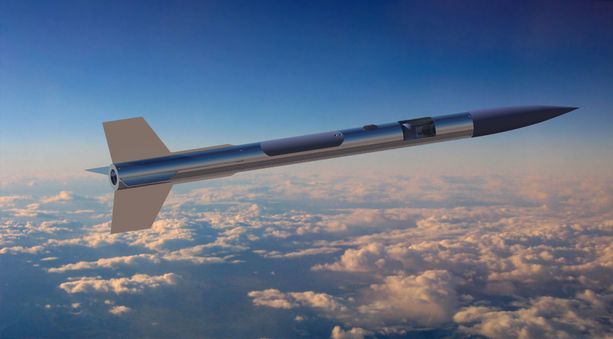
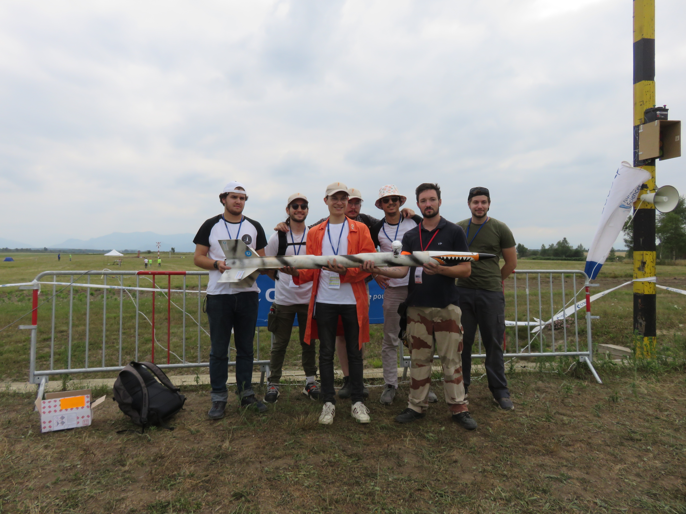

# Tigresse_2

  

Ce projet nommé Tigresse-2 est un projet de Fusée expérimentale qui volera lors de la campagne de lancement 2022 organisé par le Centre National d'Etudes Spatiales. Cette campagne, nommée C'Space regroupe tous les clubs spatiaux de France et de temps en temps des clubs spatiaux d'autres pays. 
Tigresse-2 est la seconde fusée expérimentale de l'association de l'air et de l'espace de l'université d'Orléans Space Tech Orléans.

Elle emportera une expérience afin de mesurer les résonnances de Schumann durant sa phase de redescente sous parachute.

  

La fusée a d'une hauteur de 1 mètre 85 avec une peau aluminium. L'ogive mesure 45cm.

  

"""UPDATE"""

Après une campagne de lancements de fusées au C'Space 2022, Tigresse-2 a effectué un vol nominal ! 
Voici l'équipe qui a permit ce vol parfait : 

De gauche à droite : Aymerick BATS (responsable expérience) - Loup-Maël AGULES(support technique) - Raynald DUMAS (responsable vision fusée) - Léo MARMANDE (support technique) - Hugo KREMER (responsable mécanique) - Damien POIX (chef de projet/responsable seq et CAO) - Corentin LAROCHE (responsable télémétrie).

  

Merci au CNES et à Planète Science pour cette opportunité ! 
Merci à l'équipe pour leur détermination et leur travail ! 

Go Space'Tech, Go Tigresse !
